# Profiling
[github.com/sharif-software-engineering-lab/Profiling](https://github.com/sharif-software-engineering-lab/Profiling)

## روال انجام آزمایش
### تمرین ۱
ابتدا ابزار 
YourKit
را نصب می‌کنیم. 
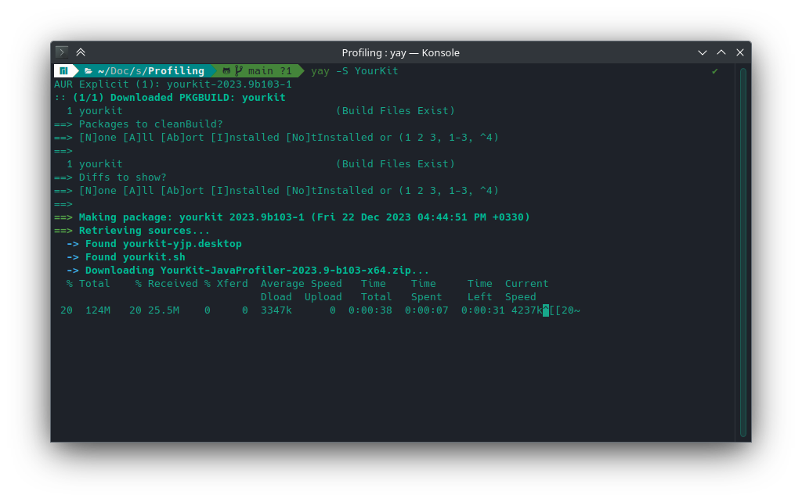
سپس با باز کردن و دنبال کردن لینک، کد فعال‌سازی دریافت می‌کنیم و برنامه را فعال می‌کنیم. 
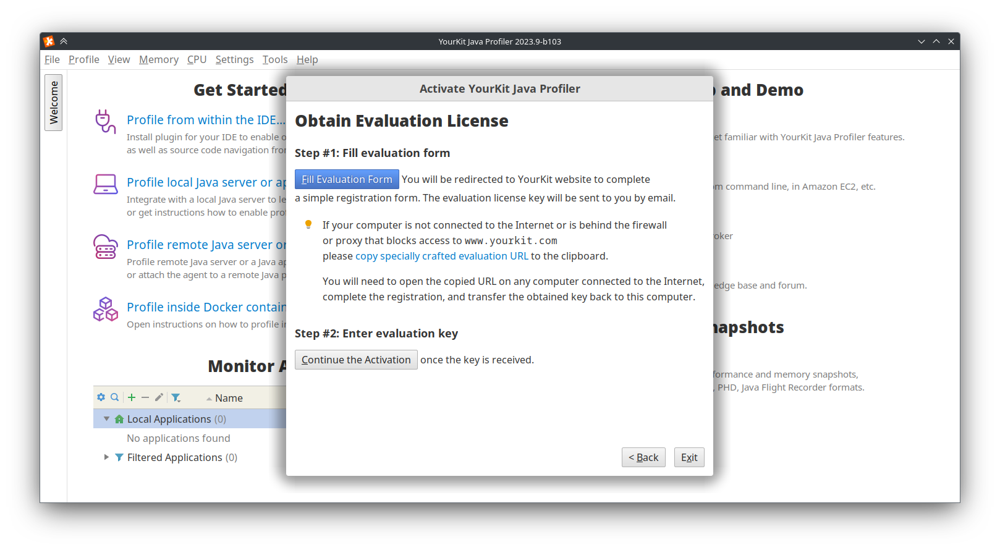
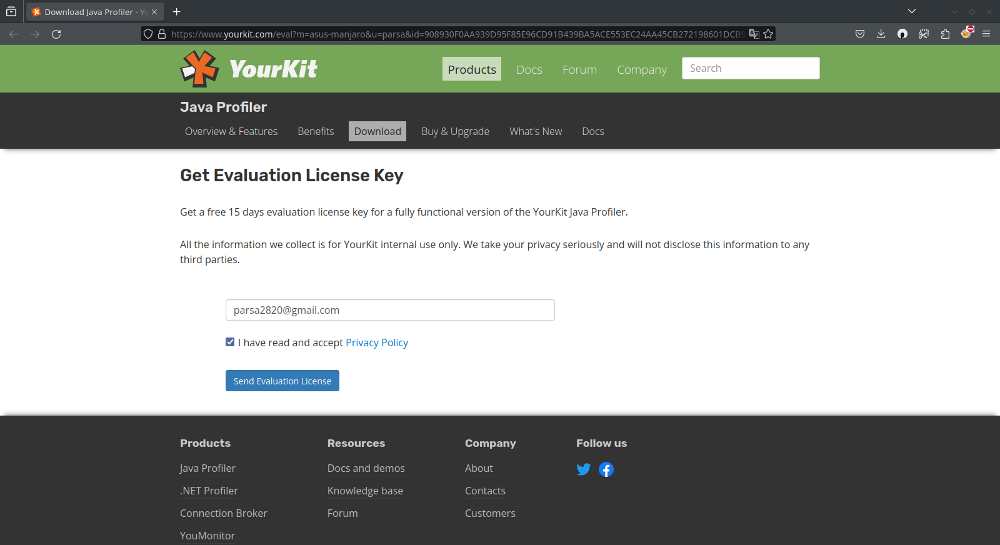
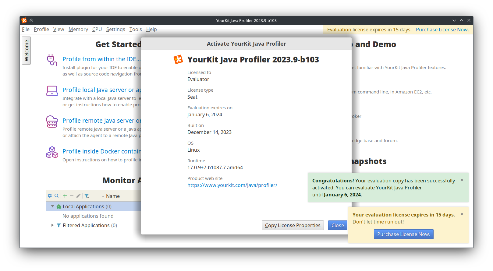
حال افزونه این برنامه را در 
IntelliJ IDEA
نصب می‌کنیم. 
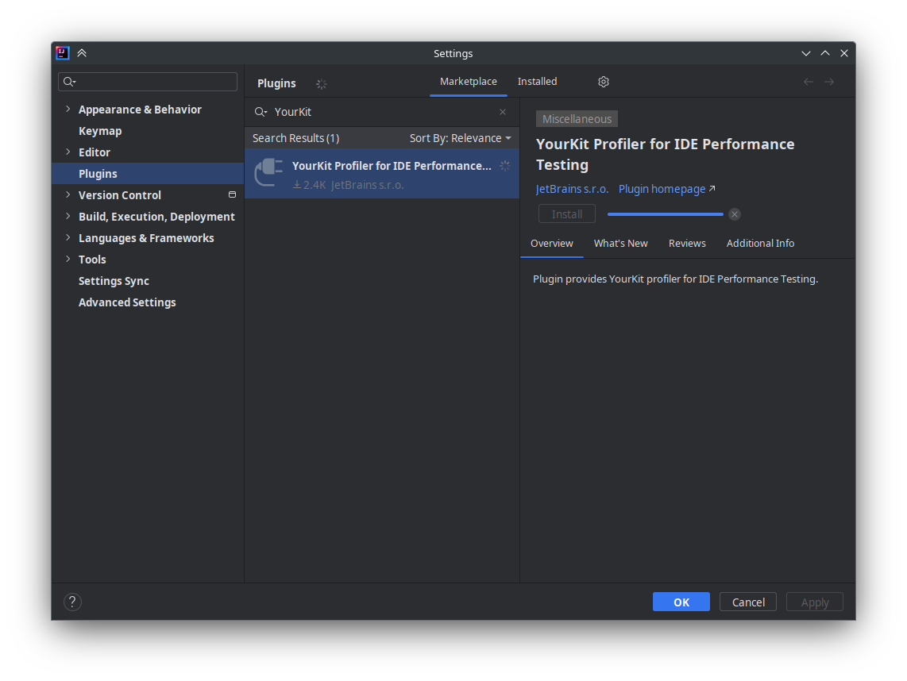
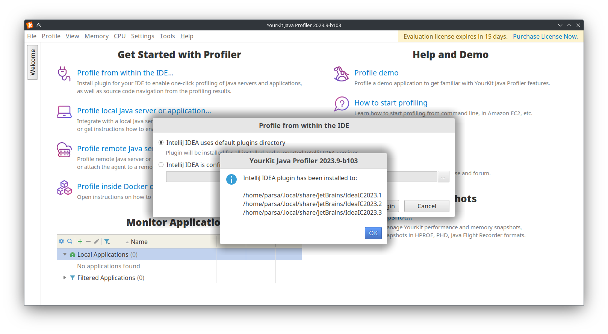
با انتخاب دکمه 
Profiling 
در 
IDE 
عملیات را آغاز می‌کنیم. 
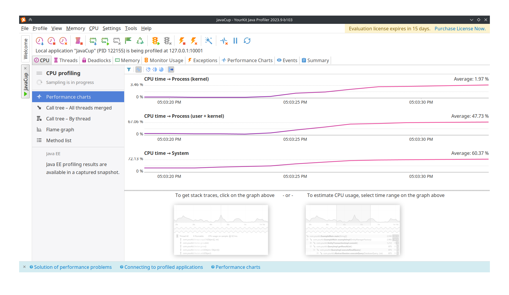
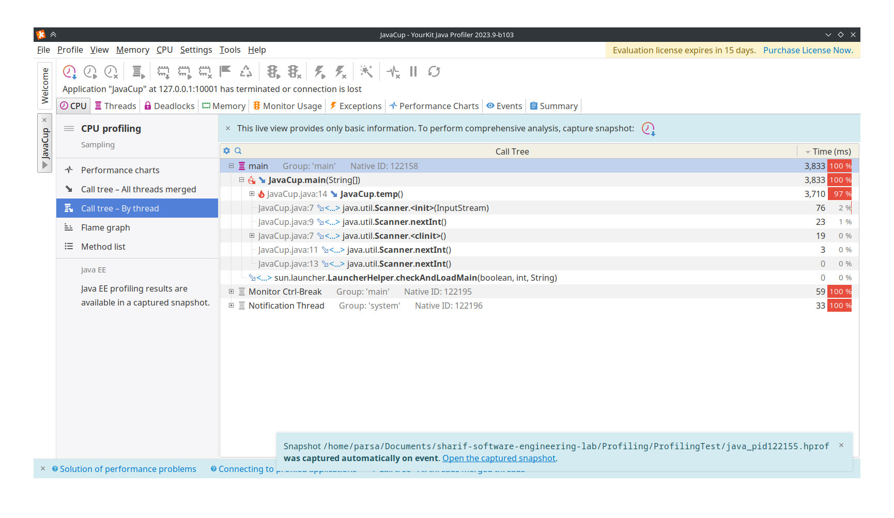
همانطور که مشاهده می‌کنیم، تابع 
temp
اکثر ریسورس را مصرف می‌کند. 
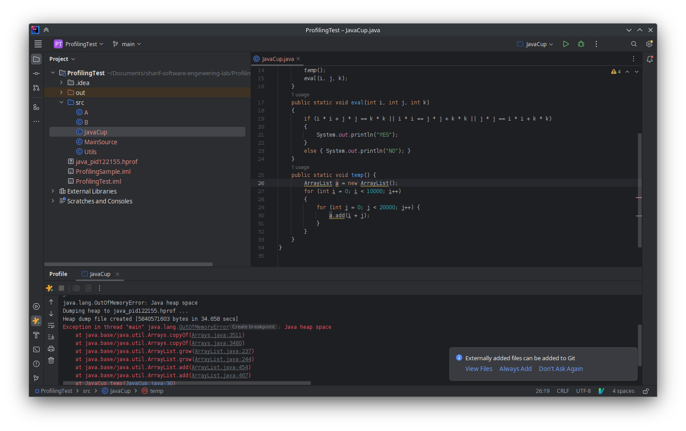
با بررسی کد متوجه می‌شویم این تابع تاثیری بر روی برنامه ندارد. پس آن را صدا نمی‌زنیم. حال برنامه را مجددا بررسی می‌کنیم. 
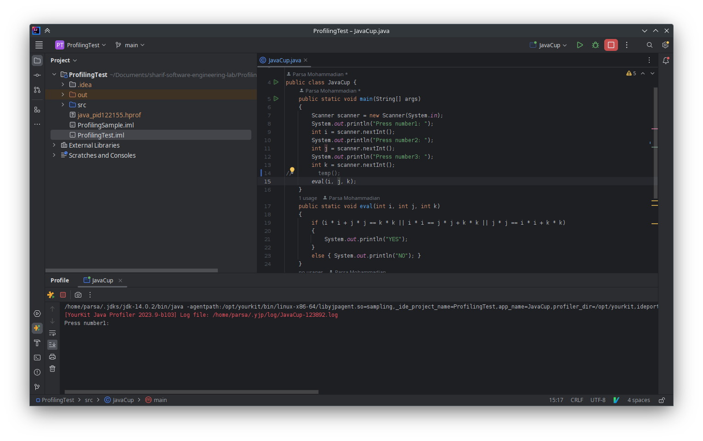
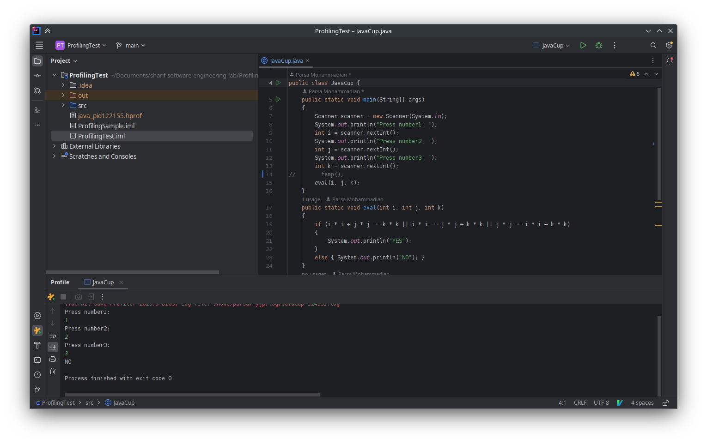
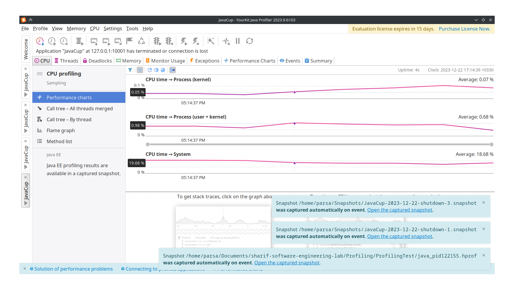
مشاهده می‌کنیم برنامه به درستی با مصرف بهینه منابع اجرا می‌شود.

### تمرین ۲
برای این قسمت ما کلاس 
Fibonacci
را پیاده‌سازی کرده‌ایم که به صورت بازگشتی عدد ۴۶ام در سری فیبوناچی را حساب می‌کند.
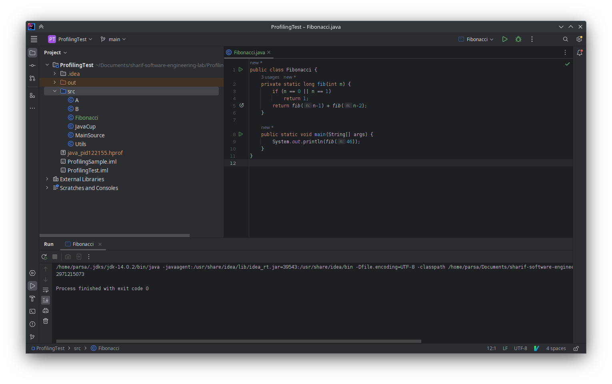
حال به بررسی مصرف منابع اجرای این کد می‌پردازیم.
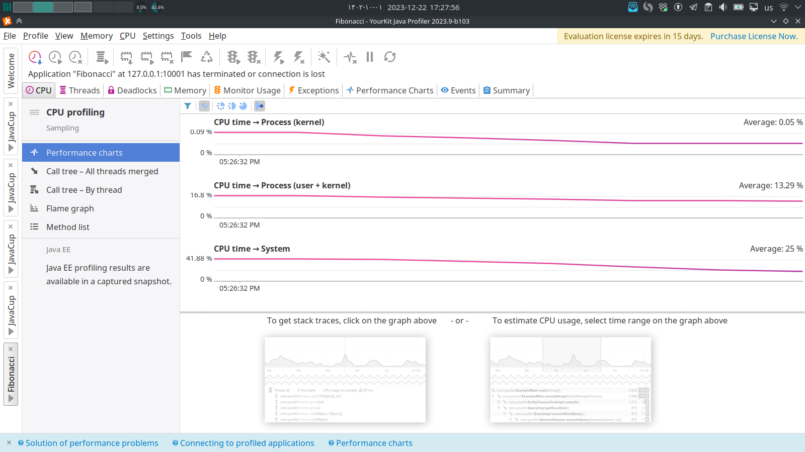
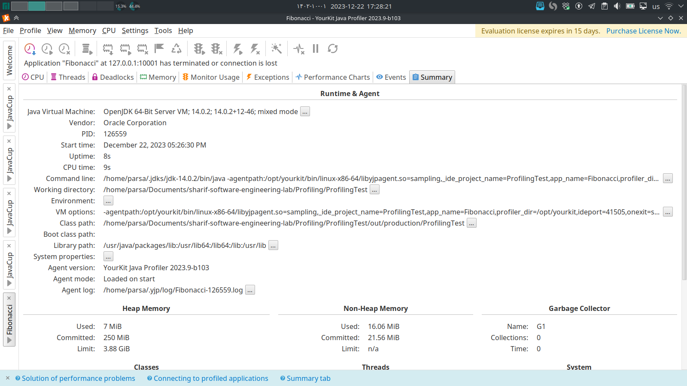
مشاهده می‌کنیم ۹ ثانیه از زمان پردازنده استفاده شده است. با بررسی بیشتر متوجه می‌شویم بیشتر زمان برنامه در تابع 
fib
سپری شده است. پس سعی می‌کنیم پیاده‌سازی این قسمت را بهتر کنیم.

پیاده‌سازی جدید این قسمت در شکل زیر قابل مشاهده است. در این پیاده‌سازی با استفاده از یک 
HashMap
تابع 
fib
بهینه شده است و نیازی ندارد چندین بار یک محاسبه تکراری را انجام دهد. 
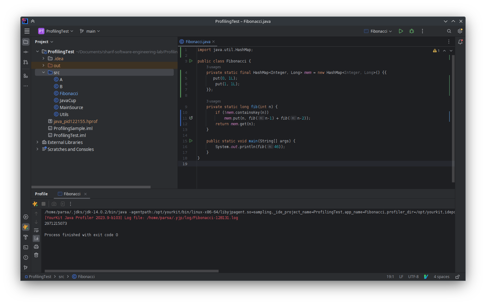
با اجرا کردن مجدد کد مشاهده می‌کنیم زمان اجرا به کمتر از ۱ ثانیه رسیده است و به مراتب 
processing power 
بسیار کمتری صرف شده است. 
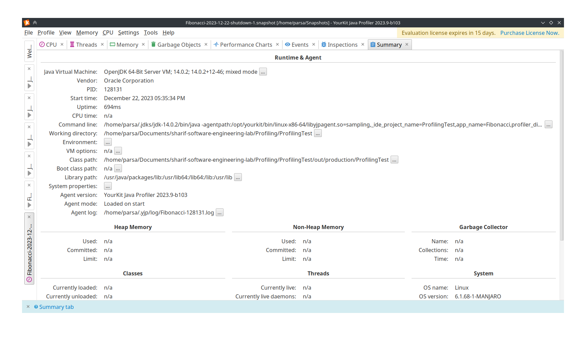

